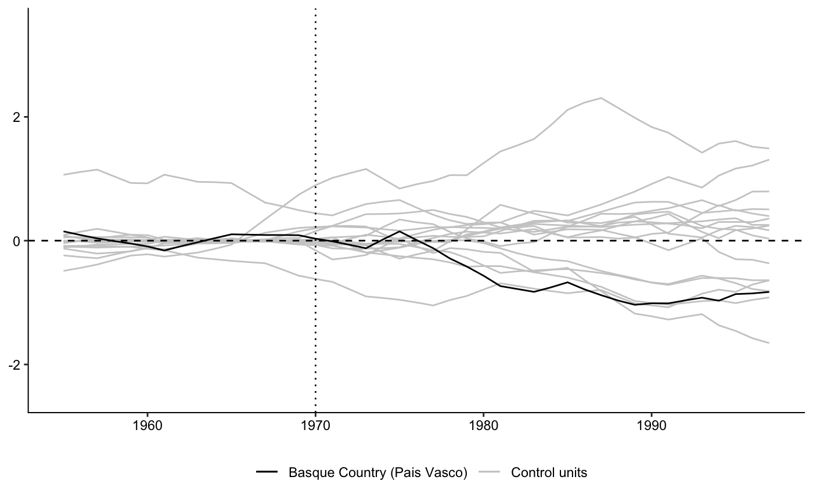

# Introduction

The Synthetic Control Method was first proposed by @abadie_economic_2003 to evaluate the impact of a specific event or policy, implemented in one geographical area (city, country, region, and so on) on an outcome of interest. It works by generating a synthetic unit which is as similar as possible to the so-called "treated" unit, except for the intervention or event from which one wants to estimate a causal effect. This synthetic unit is constructed as a weighed average of similar units which have not received the treatment. 

Formally, $W = (w_2,...w_{J+1})'$ is a $(J \times 1)$ vector of weights, where $J$ is the number of units in the donor pool. Assigning different values in this vector leads to different weighed averages for the control regions. The value of the outcome variable $Y$ in post-treatment time $t \ge t_0$ for a synthetic control indexed by $W$ is $\sum_{j=2}^{J + 1}w_jY_{jt}$. To select the optimal vector of weights $W^*$, we consider a $X_1$ vector that has pre-intervention covariates for the treated region, and a $X_0$, $(J \times K)$ vector with the same pre-intervention covariates, but for control units, both of which including the pre-treatment trend of the dependent variable. $W^*$ is chosen to minimise the distance $|| X_1 - X_0W||$, solving the minimisation problem

\begin{equation}
min(X_1 - X_0W)'V(X_1 = X_0 W)~s.t.~0 \le w_j \le 1~and~\sum_{j = 2}^{J + 1}w_j = 1 
\end{equation}

The synthetic controls method has become popular in economics, public policy evaluation, and political science, due to its intuitiveness and fitness for rigorous causal inference in single case studies. The optimization described above and by @abadie_economic_2003 is implemented in R in the `Synth` package [@Synth]. 

However, `Synth` has not kept up to date with recent developments in synthetic controls. It has no automatic feature to implement the placebo tests suggested by @abadie_comparative_2015 or @abadie_synthetic_2010, which are only available in Stata [@galiani2017synth_runner], nor more recent features such as synthetic controls for multiple treated units [@Kreif2015]. `SCtools` comes in to fill these gaps providing these extensions to `Synth`. 

<!--
* What is SCM?
* Application Areas
* Introduce Synth
  * Limitations
  * How SCtools fills in
-->

# Examples of Features

@abadie_synthetic_2010 suggests using "placebos" to test the significance of the effects identified with synthetic controls: the approach consists in creating a synthetic control for each unit in the donor pool. Given that none of them was treated, the estimated "effects" from these units, in relation to their synthetic controls, is the difference between a unit and its synthetic control one could expect by chance, under the null hypothesis of no treatment effect. Therefore, if the observed effect for the treated unit is larger than that for the placebos, this is considered evidence of an actual treatment effect, where the pseudo p-value is the proportion of placebos having an effect as large as or larger than the observed for the treated unit.

## Generation of Placebos

`SCtools` automates the generation of placebos from the donor pool, based on objects created when running synthetic control analysis with `Synth`. It returns the estimated synthetic control for each donor unit, and a `gaps plot` with the respective curves comparing each donor pool unit to its synthetic control, along with the treated unit. Figure 1 shows this plot for the case of the Basque Country, from @abadie_economic_2003, made with the `plot_placebos` function in `SCtools`, after running the Basque Country example from `Synth`. 

Placebos can then be used for another test proposed by @abadie_comparative_2015, the post/pre Mean Square Prediction Error (MSPE) test. It is the difference between the observed outcome of a unit and its synthetic control, before and after treatement. A higher ratio means a small  pre-treatment prediction error (a good synthetic control), combined with a high post-treatment MSPE, meaning a large difference between the unit  and its synthetic control after the intervention. By calculating this ratio for all placebos, the test can be interpreted  as looking at how likely the result obtained for a single treated case  with a synthetic control analysis could have occurred by chance given no treatement. `SCtools` also provides a post/pre MSPE plot and its associated pseudo p-value.

## Multiple Synthetic Control

An important advance in Synthetic Controls has been the estimation of causal effects for interventions with multiple treated units [@Kreif2015,@Cavallo2013]. For these, one synthetic control is estimated for each treated unit. Then, the average distance between each treated unit and its synthetic control, before and after the intervention, is taken to indicate the goodness-of-fit (before treatment) and the esitmated average treatment effect (after treatment). `SCtools` implements a change to the familiar `dataprep()` function from `Synth`, in order to accommodate multiple treated units and return a plot with the estimated average path for treated units and their synthetic controls.

Inference of causal effects with multiple treated units is also done using placebos. In this case, once again one synthetic control is created for each unit in the donor pool. `SCtools` implements a bootstrap approach is used to calculate a p-value for the average treatment effect estimate. It works by sampling `k` placebos (where k = the number of treated units) `n` times, calculating the estimated average placebo effect each time, and at the end having a distribution of average placebo effects. Comparing the observed average treatment effect to this distribution of average placebo effects gives an estimated p-value for the observed ATT. 

# Future Work

# Licensing and Availability

**SCtools** is licensed under the GNU General Public License (v3.0), with all source code stored at GitHub (https://github.com/bcastanho/SCtools), and with a corresponding issue tracker for bug reporting and feature enhancements.   

# References
